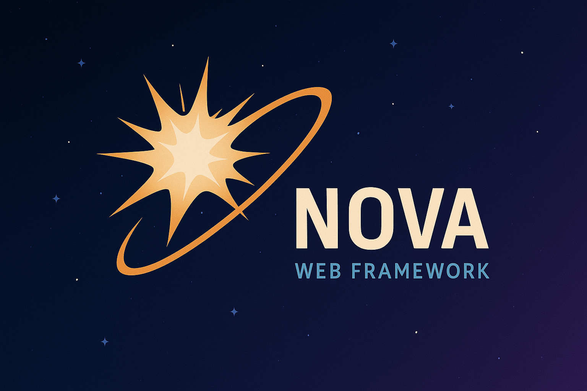

<p align="center">
  <a href="https://github.com/xlc-dev/nova">
    
  </a>
</p>

<h1 align="center">Nova</h1>

<p align="center" style="font-size: 1.2em; color: #586069;">
  Build Powerful Web Applications in Go, Faster.
</p>

<p align="center">
  <a href="https://github.com/xlc-dev/nova/actions"></a>
  <a href="https://goreportcard.com/report/github.com/xlc-dev/nova"></a>
  <a href="https://pkg.go.dev/github.com/xlc-dev/nova"></a>
  <a href="https://github.com/xlc-dev/nova/releases"></a>
  <a href="./LICENSE"></a>
  <a href="https://xlc-dev.github.io/nova/book"></a>
  <a href="https://github.com/xlc-dev/nova/stargazers"></a>
</p>

---

Nova is a Go framework designed to help you build robust and scalable web applications with ease. It leverages the power of Go's standard library while providing convenient tools and abstractions to accelerate your development workflow.

Nova consists of two main components:

- **The Nova Binary:** A command-line tool (installed via `go install`) that handles project generation, scaffolding, and database migrations. It's perfect for setting up new projects quickly and managing some boilerplate.
- **The Nova Library:** The library that provides the functionality for building web applications, including REST APIs, middleware, and more. Your generated projects with the binary import this library.

## Features

- **CLI Tooling:** Integrated command-line tooling to build any CLI for your application.
- **Project Scaffolding:** Quickly generate new projects with a sensible default structure using `nova new`.
- **Database Migrations:** Manage database migrations effortlessly with the `nova` binary.
- **Streamlined REST APIs:** Simplified routing, request handling, and response generation.
- **Validation & OpenAPI:** Built-in support for request validation and OpenAPI (Swagger) spec generation.
- **Middleware Support:** Easily add and manage middleware for enhanced functionality.
- **Templating Engine:** Built-in support for building HTML templates within Go files.

## Getting Started

### Prerequisites

- Go 1.23 or later

### Installation

Install the Nova binary globally to get started with a Nova project quickly:

```sh
go install github.com/xlc-dev/nova@latest
```

### Quick Start

1.  **Create a new Nova project:**
    Follow the interactive prompts to set up your application.

    ```sh
    nova new myproject
    ```

2.  **Navigate to your project directory:**

    ```sh
    cd myproject
    ```

3.  **Build and run your application:**
    The generated project includes the Nova library, so building it will handle the web application logic.

    ```sh
    # Build the binary
    go build -o novarun

    # Run the application
    ./novarun
    ```

    Your application should now be running on `http://localhost:8080`. From here, you can explore the library's features like REST APIs and middleware.

### Common Go Commands

Here are some common Go commands you might use for development:

- **Build the application:**

  ```sh
  go build -o novarun
  ```

  This command compiles your Go application and creates an executable named `novarun` in the current directory.

- **Run the application:**

  ```sh
  ./novarun
  ```

  Executes the built application.

- **Format Go source code:**

  ```sh
  goimports -w .
  go fmt ./...
  ```

  These commands format your Go code according to Go's standard style. `goimports` also adds/removes necessary imports.

- **Run tests:**
  ```sh
  go test ./... -v
  ```
  This command runs all tests in your project and its subdirectories, with verbose output.

## Documentation

Documentation is available to guide you through Nova's features and usage. The docs are created and built using [ffsg](https://xlc-dev.github.io/fssg/).
A fast static site generator written by yours truely.
All documentation can be found in the `docs/src` folder written in Markdown.

**[Read the full documentation here](https://xlc-dev.github.io/nova/docs)**

## Contributing

Contributions are welcome! Whether it's bug reports, feature requests, documentation improvements, or code contributions, please feel free to open an issue or submit a pull request.

Please read the [CONTRIBUTING.md](./CONTRIBUTING.md) for guidelines.

## License

This project is licensed under the MIT License. See the [LICENSE](./LICENSE) file for details.
