# Design

This document describes the design of the Nova framework and its architecture.

## Table of Contents

1.  [Design Philosophy](#design-philosophy)
    - [Design Principles](#design-principles)
2.  [Architecture & Flow](#architecture--flow)
    - [CLI](#cli)
      - [Main CLI Execution Flow: Initialization & Global Flags](#main-cli-execution-flow-initialization--global-flags)
      - [Helper: `parseFlagSet`](#helper-parseflagset)
      - [Helper: `validateFlags`](#helper-validateflags)
      - [Command Processing Flow](#command-processing-flow)
      - [Fallback Flow: Global Action / Unknown Command / Main Help](#fallback-flow-global-action--unknown-command--main-help)
    - [Router](#router)
      - [Main Router Operations](#main-router-operations)
      - [Flow: Router Initialization (`NewRouter`)](#flow-router-initialization-newrouter)
      - [Flow: Route Registration (`Router.Handle`)](#flow-route-registration-routerhandle)
      - [Flow: Group Creation & Handling (`Router.Group` & `Group.Handle`)](#flow-group-creation--handling-routergroup--grouphandle)
      - [Flow: Middleware Registration (`Router.Use`)](#flow-middleware-registration-routeruse)
      - [Flow: Subrouter Creation (`Router.Subrouter`)](#flow-subrouter-creation-routersubrouter)
      - [Flow: Request Dispatching - (`Router.ServeHTTP`)](#flow-request-dispatching-routerservehttp)
      - [Flow: URL Parameter Retrieval (`Router.URLParam`)](#flow-url-parameter-retrieval-routerurlparam)
    - [Scaffolding](#scaffolding)
    - [Migrations](#migrations)
      - [Migration Actions](#migration-actions)
      - [Flow: CreateNewMigration](#flow-createnewmigration)
      - [Flow: MigrateUp](#flow-migrateup)
      - [Flow: MigrateDown](#flow-migratedown)
    - [OpenAPI](#openapi)
      - [Overall OpenAPI Process](#overall-openapi-process)
      - [Flow: Generate OpenAPI Spec](#flow-generateopenapispec)
      - [Flow: collect routes (recursive)](#flow-collectroutes-recursive)
      - [Flow: build operation](#flow-buildoperation)
      - [Flow: generate schema (recursive & type handling)](#flow-generateschema-recursive--type-handling)
      - [Flow: serve swagger ui](#flow-serveswaggerui)

## Design Philosophy

Nova is designed to be lightweight and flexible. It's built on top of the standard library,
without any external dependencies except [fsnotify](https://github.com/fsnotify/fsnotify)
for file watching and database drivers for migrations and `database/sql` support.

The supported database drivers are:

- [SQLite](https://github.com/mattn/go-sqlite3)
- [PostgreSQL](https://github.com/lib/pq)
- [MySQL/MariaDB](https://github.com/go-sql-driver/mysql)

it is very easy to add a new databse driver
to nova if requested, as long as it follows the design philosophy of the framework.

The goal of the framework is to be modular and extensible, so it is designed to follow as many
standards as possible wihtin the Go community, with the goal being able to plug and play different components within the framework.

### Design Principles

- **Minimal Dependencies:** Nova is designed to have as few dependencies as possible.
- **Simplicity:** Nova is designed to be simple and easy to use. Follow pattenrs that Golang developers are already familiar with.
- **Stable:** Nova is designed to be stable and reliable. That is another benifit of only using the standard library which is known to be stable.
- **Reduce Boilerplate:** Nova is designed to reduce boilerplate code, so the developr can focus on what is the most important: the business logic.
- **Batteries Included:** Nova comes with batteries included. It comes with many components like a CLI and router, removing decision fatique, needing to write boilerplate code or installing external dependencies.
- **Undocumented features are bugs:** Undocmunted code or unwritten documentation is concidered a bug, allowing for _actual_ up to date documentation.

## Architecture & Flow

In this chapter you will find diagrams of the architecture of the Nova framework.

### CLI

One of the core components of the Nova framework is the CLI.
The CLI is able to parse any command line arguments and flags, and execute actions based on the provided flags.

The overall execution flow can be broken down into several key stages:

#### Main CLI Execution Flow: Initialization & Global Flags

This initial stage of `CLI.Run` handles the setup and processing of global aspects of the command.
It verifies that the CLI has been properly initialized. Then, it separates the provided arguments into global flags and the remaining arguments (which might contain a command and its specific flags).
Global flags are parsed and validated. A special check for a `--version` flag is performed to allow for quick version printing without further processing.
If global flag parsing or validation fails, the process terminates with an error. Otherwise, it proceeds to find and execute a command.

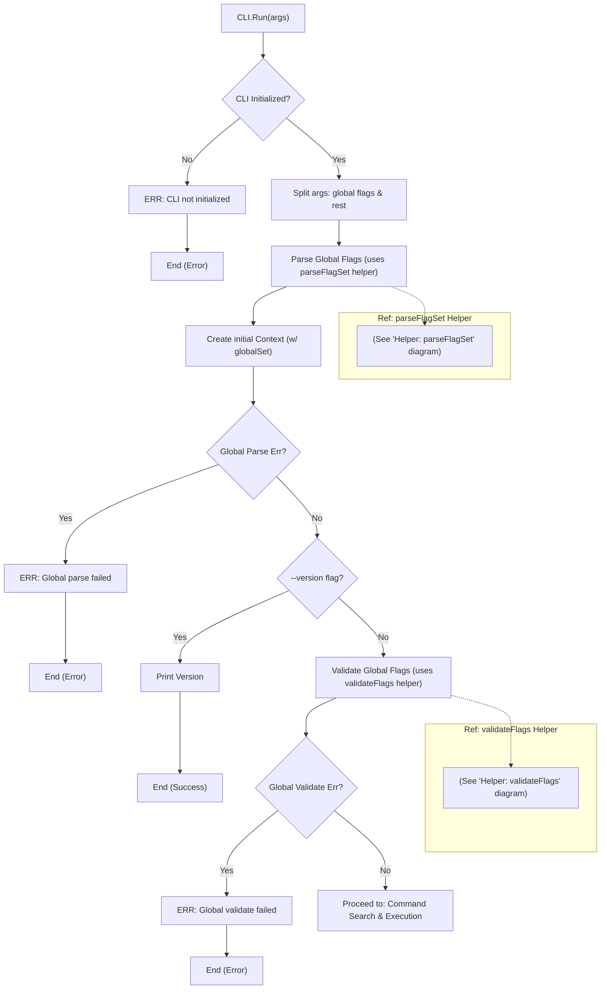
```mermaid
flowchart TB
    A["CLI.Run(args)"] --> B{"CLI Initialized?"}
    B -- No --> B_ERR["ERR: CLI not initialized"]
    B_ERR --> Z_END_INIT_ERR["End (Error)"]
    B -- Yes --> C["Split args: global flags & rest"]
    C --> D["Parse Global Flags (uses parseFlagSet helper)"]
    D --> D_CTX["Create initial Context (w/ globalSet)"]
    D_CTX --> E{"Global Parse Err?"}
    E -- Yes --> E_ERR["ERR: Global parse failed"]
    E_ERR --> Z_END_GLOBAL_PARSE_ERR["End (Error)"]
    E -- No --> F{"--version flag?"}
    F -- Yes --> G["Print Version"]
    G --> Z_SUCCESS_VERSION["End (Success)"]
    F -- No --> H["Validate Global Flags (uses validateFlags helper)"]
    H --> I{"Global Validate Err?"}
    I -- Yes --> I_ERR["ERR: Global validate failed"]
    I_ERR --> Z_END_GLOBAL_VALIDATE_ERR["End (Error)"]
    I -- No --> J_LINK["Proceed to: Command Search & Execution"]

    subgraph subGraph0_ref["Ref: parseFlagSet Helper"]
        direction TB
        REF_PF["(See 'Helper: parseFlagSet' diagram)"]
    end

    subgraph subGraph1_ref["Ref: validateFlags Helper"]
        direction TB
        REF_VF["(See 'Helper: validateFlags' diagram)"]
    end

    D -.-> REF_PF
    H -.-> REF_VF
```

#### Helper: `parseFlagSet`

This helper function is responsible for the mechanics of parsing a set of flags.
It takes a list of flag definitions, the arguments to parse, a name for the flag set (often "global" or the command name), and an output stream (for help messages).
It creates a standard `flag.FlagSet` instance, applies the defined flags to this set, and then calls the `Parse` method on the set with the provided arguments.
It returns the populated `FlagSet` and any error encountered during parsing.

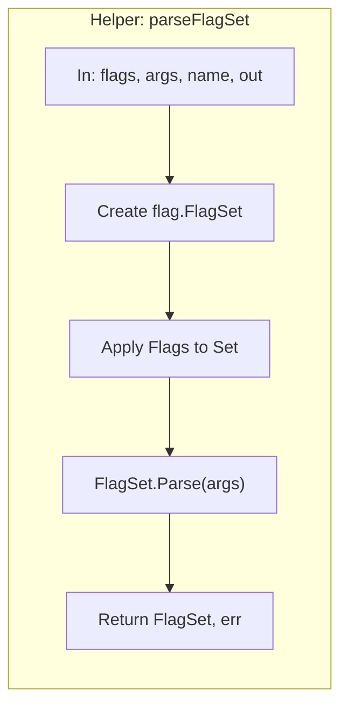
```mermaid
flowchart TB
 subgraph subGraph0["Helper: parseFlagSet"]
    direction TB
        PF1["In: flags, args, name, out"]
        PF2["Create flag.FlagSet"]
        PF3["Apply Flags to Set"]
        PF4["FlagSet.Parse(args)"]
        PF5["Return FlagSet, err"]
  end
    PF1 --> PF2
    PF2 --> PF3
    PF3 --> PF4
    PF4 --> PF5
```

#### Helper: `validateFlags`

After flags are parsed by `parseFlagSet`, this helper function is used to perform custom validation on each flag.
It iterates through a list of flag definitions and, for each flag, calls its `Validate` method, passing in the `FlagSet` (which contains the parsed values).
If any flag's `Validate` method returns an error, these errors are combined and returned. If all flags validate successfully, it returns `nil`.

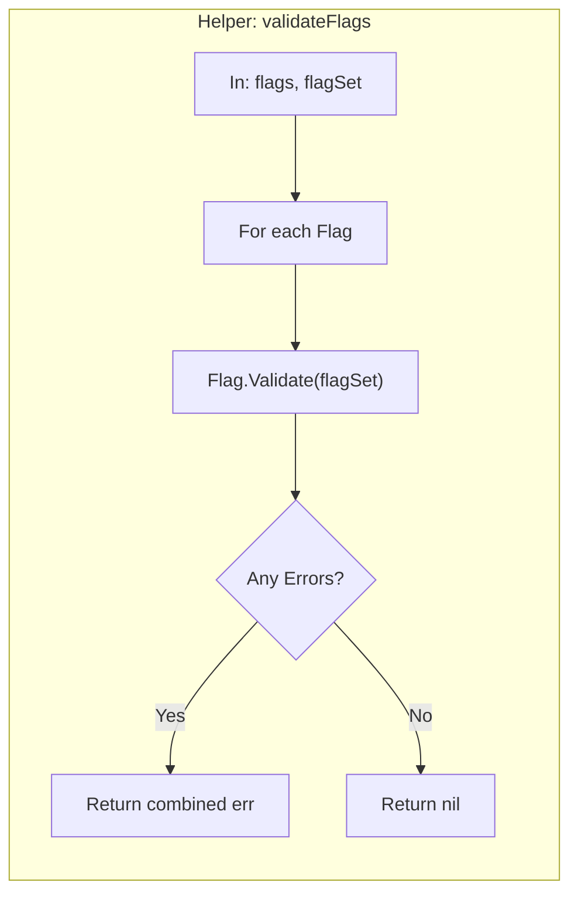
```mermaid
flowchart TB
 subgraph subGraph1["Helper: validateFlags"]
    direction TB
        VF1["In: flags, flagSet"]
        VF2["For each Flag"]
        VF3["Flag.Validate(flagSet)"]
        VF4{"Any Errors?"}
        VF5["Return combined err"]
        VF6["Return nil"]
  end
    VF1 --> VF2
    VF2 --> VF3
    VF3 --> VF4
    VF4 -- Yes --> VF5
    VF4 -- No --> VF6
```

#### Command Processing Flow

Once global flags are successfully parsed and validated, the CLI attempts to identify and execute a specific command.
It searches for a command based on the first argument in `restArgs` (the arguments remaining after global flags). This search includes registered commands, their aliases, and a built-in `help` command.

If a command is found:

- If it's the `help` command, the context is prepared for help output, and the help action is executed.
- If it's a user-defined command, its specific flags are parsed (using `parseFlagSet`) and validated (using `validateFlags`). The CLI context is updated with command-specific information. If parsing or validation fails, an error is reported. Otherwise, the command's action is executed.

If no command is found matching the first argument, the flow proceeds to the fallback mechanisms.

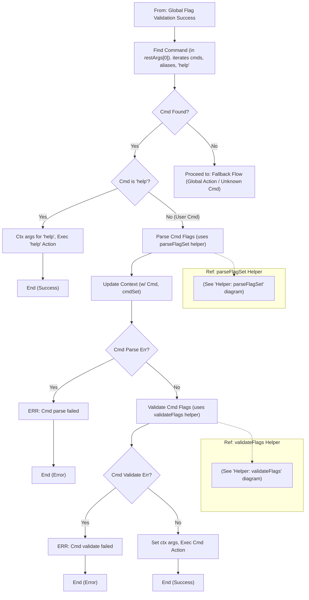
```mermaid
flowchart TB
    J_START["From: Global Flag Validation Success"] --> J_NODE
    J_NODE["Find Command (in restArgs[0]). iterates cmds, aliases, 'help'"] --> K{"Cmd Found?"}
    K -- Yes --> L{"Cmd is 'help'?"}
    L -- Yes --> M["Ctx args for 'help', Exec 'help' Action"]
    M --> Z_SUCCESS_HELP["End (Success)"]
    L -- No (User Cmd) --> N["Parse Cmd Flags (uses parseFlagSet helper)"]
    N --> N_CTX["Update Context (w/ Cmd, cmdSet)"]
    N_CTX --> O{"Cmd Parse Err?"}
    O -- Yes --> O_ERR["ERR: Cmd parse failed"]
    O_ERR --> Z_END_CMD_PARSE_ERR["End (Error)"]
    O -- No --> P["Validate Cmd Flags (uses validateFlags helper)"]
    P --> Q{"Cmd Validate Err?"}
    Q -- Yes --> Q_ERR["ERR: Cmd validate failed"]
    Q_ERR --> Z_END_CMD_VALIDATE_ERR["End (Error)"]
    Q -- No --> R["Set ctx args, Exec Cmd Action"]
    R --> Z_SUCCESS_CMD_EXEC["End (Success)"]

    K -- No --> S_LINK["Proceed to: Fallback Flow (Global Action / Unknown Cmd)"]

    subgraph subGraph0_ref_cmd["Ref: parseFlagSet Helper"]
        direction TB
        REF_PF_CMD["(See 'Helper: parseFlagSet' diagram)"]
    end

    subgraph subGraph1_ref_cmd["Ref: validateFlags Helper"]
        direction TB
        REF_VF_CMD["(See 'Helper: validateFlags' diagram)"]
    end

    N -.-> REF_PF_CMD
    P -.-> REF_VF_CMD
```

#### Fallback Flow: Global Action / Unknown Command / Main Help

This flow is triggered if no specific command is identified from the arguments.
The CLI checks if a global action (an action to be performed if no command is specified) has been defined.

- If a global action exists, the remaining arguments (`restArgs`) are set in the context, and the global action is executed.
- If no global action is defined, the CLI checks if there were any `restArgs`.
  - If `restArgs` exist, it implies the user tried to run a command that doesn't exist, so an "Unknown command" error is shown.
  - If no `restArgs` exist (meaning only global flags or no arguments were provided, and no command was matched), the main help message for the CLI application is displayed.

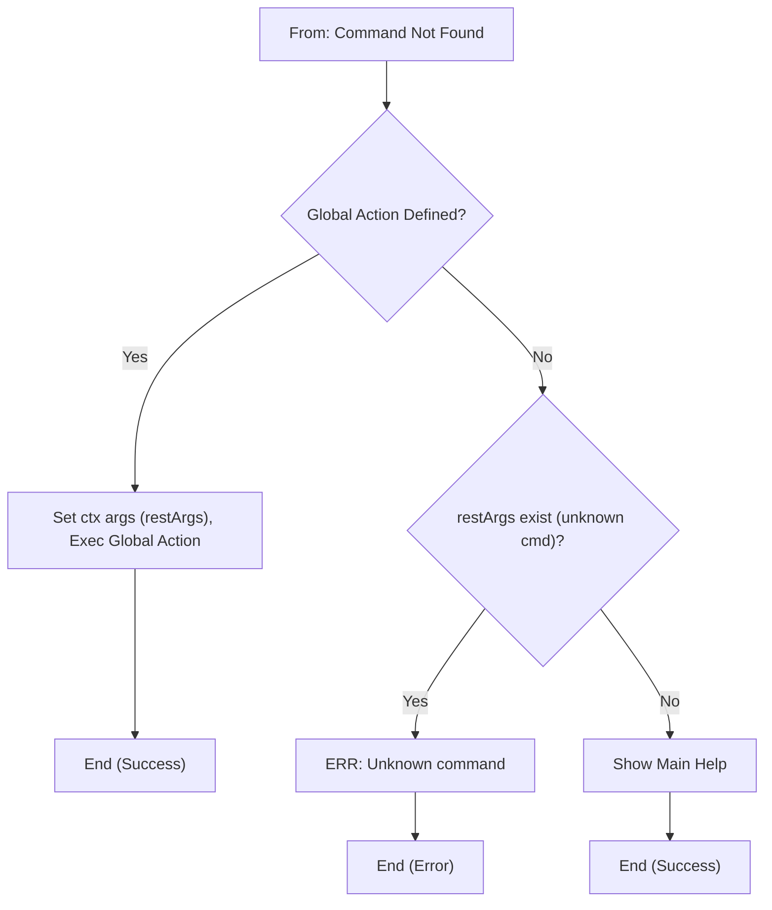
```mermaid
flowchart TB
    S_START["From: Command Not Found"] --> S{"Global Action Defined?"}
    S -- Yes --> T["Set ctx args (restArgs), Exec Global Action"]
    T --> Z_SUCCESS_GLOBAL_ACTION["End (Success)"]
    S -- No --> U{"restArgs exist (unknown cmd)?"}
    U -- Yes --> V["ERR: Unknown command"]
    V --> Z_END_UNKNOWN_CMD_ERR["End (Error)"]
    U -- No --> W["Show Main Help"]
    W --> Z_SUCCESS_MAIN_HELP["End (Success)"]
```

### Router

The `nova` Router is responsible for directing incoming HTTP requests to the appropriate handler functions based on the request's method and URL path.
It supports dynamic path parameters with optional regex validation, middleware, sub-routers for modular organization, and route groups for applying common prefixes and middleware to a set of routes.

#### Main Router Operations

Users primarily interact with the Router by creating a new instance,
registering routes with associated handlers and middleware, potentially mounting sub-routers or creating route groups.

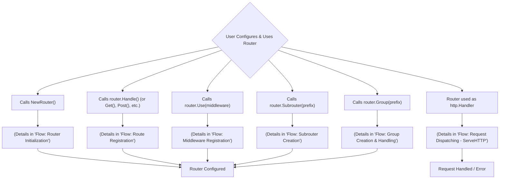
```mermaid
flowchart TD
    A_USER_ACTION{"User Configures & Uses Router"}
    A_USER_ACTION --> A1["Calls NewRouter()"]
    A_USER_ACTION --> A2["Calls router.Handle() (or Get(), Post(), etc.)"]
    A_USER_ACTION --> A3["Calls router.Use(middleware)"]
    A_USER_ACTION --> A4["Calls router.Subrouter(prefix)"]
    A_USER_ACTION --> A5["Calls router.Group(prefix)"]
    A_USER_ACTION --> A6["Router used as http.Handler"]

    A1 --> REF_NEW_ROUTER["(Details in 'Flow: Router Initialization')"]
    A2 --> REF_HANDLE["(Details in 'Flow: Route Registration')"]
    A3 --> REF_USE_MW["(Details in 'Flow: Middleware Registration')"]
    A4 --> REF_SUBROUTER["(Details in 'Flow: Subrouter Creation')"]
    A5 --> REF_GROUP["(Details in 'Flow: Group Creation & Handling')"]
    A6 --> REF_SERVE_HTTP["(Details in 'Flow: Request Dispatching - ServeHTTP')"]

    REF_NEW_ROUTER --> Z_END_CONFIG["Router Configured"]
    REF_HANDLE --> Z_END_CONFIG
    REF_USE_MW --> Z_END_CONFIG
    REF_SUBROUTER --> Z_END_CONFIG
    REF_GROUP --> Z_END_CONFIG
    REF_SERVE_HTTP --> Z_END_REQUEST_HANDLED["Request Handled / Error"]
```

#### Flow: Router Initialization (`NewRouter`)

This function creates a new, empty `Router` instance. It initializes internal slices for routes and sub-routers, sets up a unique context key for URL parameters, and establishes a default (passthrough) middleware chain.

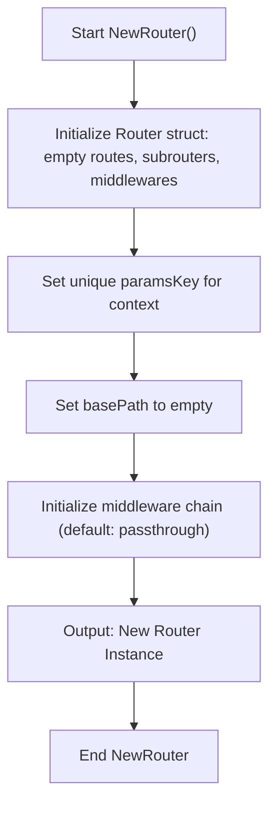
```mermaid
flowchart TD
    NR_START["Start NewRouter()"] --> NR1["Initialize Router struct: empty routes, subrouters, middlewares"]
    NR1 --> NR2["Set unique paramsKey for context"]
    NR2 --> NR3["Set basePath to empty"]
    NR3 --> NR4["Initialize middleware chain (default: passthrough)"]
    NR4 --> NR_OUTPUT["Output: New Router Instance"]
    NR_OUTPUT --> NR_END["End NewRouter"]
```

#### Flow: Route Registration (`Router.Handle`)

This is the core method for defining a route. It takes an HTTP method, a URL pattern, and a handler function. The URL pattern is compiled into segments (literals or parameters with optional regex). If the router has a `basePath` (e.g., if it's a subrouter), this path is prepended to the given pattern. The compiled route is then stored. Helper methods like `Get()`, `Post()` internally call `Handle()`.

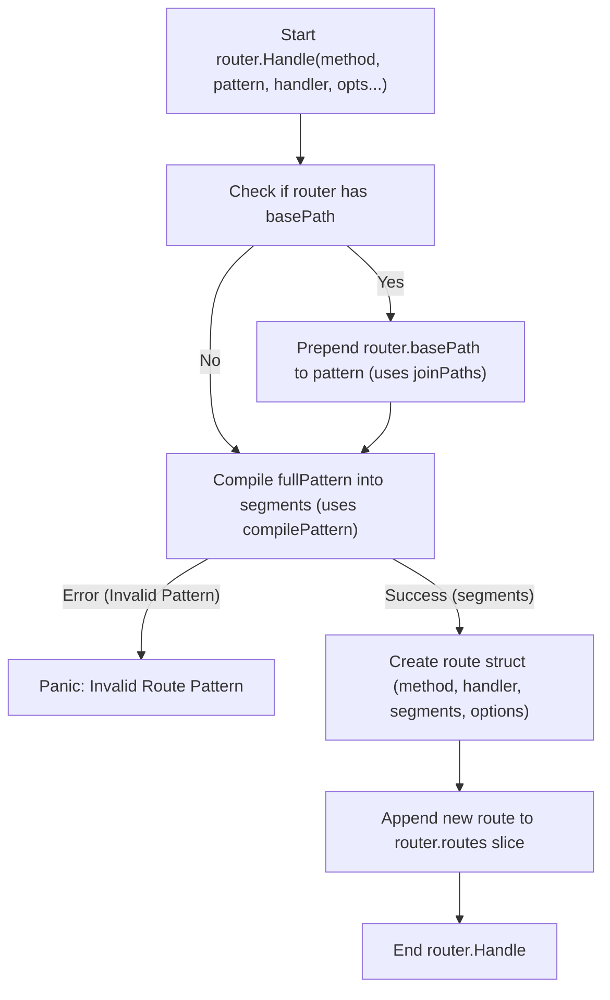
```mermaid
flowchart TD
    RH_START["Start router.Handle(method, pattern, handler, opts...)"] --> RH1["Check if router has basePath"]
    RH1 -- Yes --> RH2_JOIN["Prepend router.basePath to pattern (uses joinPaths)"]
    RH1 -- No --> RH2_COMPILE
    RH2_JOIN --> RH2_COMPILE["Compile fullPattern into segments (uses compilePattern)"]
    RH2_COMPILE -- Error (Invalid Pattern) --> RH_PANIC["Panic: Invalid Route Pattern"]
    RH2_COMPILE -- Success (segments) --> RH3["Create route struct (method, handler, segments, options)"]
    RH3 --> RH4["Append new route to router.routes slice"]
    RH4 --> RH_END["End router.Handle"]
```

**Internal Detail: `compilePattern(pattern)`**
This helper parses a URL pattern string (e.g., `/users/{id:\d+}`) into a sequence of `segment` structs. Each segment is either a literal string or a parameter (e.g., `id`). Parameters can include an optional regex (e.g., `\d+`) which is pre-compiled for efficient matching.

#### Flow: Group Creation & Handling (`Router.Group` & `Group.Handle`)

A `Group` allows defining a common prefix and/or middleware for a set of routes. `Router.Group()` creates a `Group` instance, storing the prefix and any group-specific middleware. When `Group.Handle()` (or `group.Get()`, etc.) is called, it prepends the group's prefix to the route pattern, wraps the handler with the group's middleware, and then calls the underlying `router.Handle()` method.

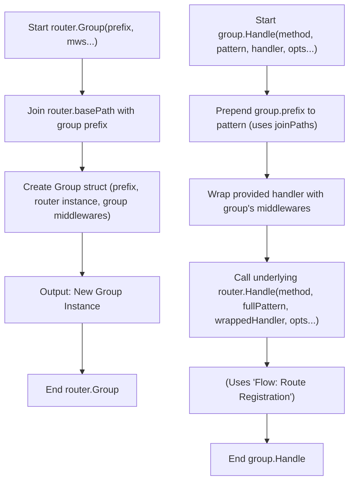
```mermaid
flowchart TD
    %% Router.Group
    RG_START_ROUTER["Start router.Group(prefix, mws...)"] --> RG1["Join router.basePath with group prefix"]
    RG1 --> RG2["Create Group struct (prefix, router instance, group middlewares)"]
    RG2 --> RG_OUTPUT["Output: New Group Instance"]
    RG_OUTPUT --> RG_END_ROUTER["End router.Group"]

    %% Group.Handle
    GH_START["Start group.Handle(method, pattern, handler, opts...)"] --> GH1["Prepend group.prefix to pattern (uses joinPaths)"]
    GH1 --> GH2_WRAP["Wrap provided handler with group's middlewares"]
    GH2_WRAP --> GH3_FORWARD["Call underlying router.Handle(method, fullPattern, wrappedHandler, opts...)"]
    GH3_FORWARD --> REF_ROUTER_HANDLE["(Uses 'Flow: Route Registration')"]
    REF_ROUTER_HANDLE --> GH_END["End group.Handle"]
```

#### Flow: Middleware Registration (`Router.Use`)

This method allows adding one or more `Middleware` functions to the router. These middlewares are applied globally to all routes handled by this router (and inherited by its subrouters). After adding new middleware, the router's internal middleware `chain` is rebuilt.

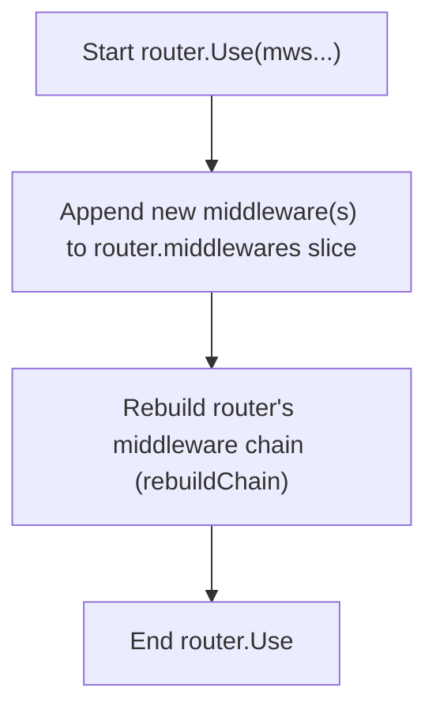
```mermaid
flowchart TD
    MWU_START["Start router.Use(mws...)"] --> MWU1["Append new middleware(s) to router.middlewares slice"]
    MWU1 --> MWU2["Rebuild router's middleware chain (rebuildChain)"]
    MWU2 --> MWU_END["End router.Use"]
```

**Internal Detail: `rebuildChain()`**
This function iterates through the registered middlewares in reverse order, wrapping the final handler (or the previously wrapped handler) with each middleware. This creates a single composed `http.Handler` that executes all middlewares in the correct sequence before reaching the route-specific handler.

#### Flow: Subrouter Creation (`Router.Subrouter`)

`Subrouter` allows mounting another `Router` instance at a specified path prefix. The new subrouter inherits the parent's context key for parameters, its global middleware chain, and custom error handlers. The `basePath` of the subrouter is set by joining the parent's `basePath` with the new prefix.

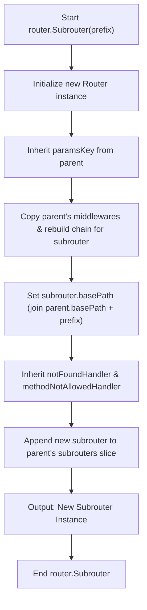
```mermaid
flowchart TD
    SR_START["Start router.Subrouter(prefix)"] --> SR1["Initialize new Router instance"]
    SR1 --> SR2["Inherit paramsKey from parent"]
    SR2 --> SR3["Copy parent's middlewares & rebuild chain for subrouter"]
    SR3 --> SR4["Set subrouter.basePath (join parent.basePath + prefix)"]
    SR4 --> SR5["Inherit notFoundHandler & methodNotAllowedHandler"]
    SR5 --> SR6["Append new subrouter to parent's subrouters slice"]
    SR6 --> SR_OUTPUT["Output: New Subrouter Instance"]
    SR_OUTPUT --> SR_END["End router.Subrouter"]
```

#### Flow: Request Dispatching (`Router.ServeHTTP`)

This is the core of the router, implementing `http.Handler`. When a request arrives:

1.  It first checks if the request path matches the `basePath` of any registered subrouters. If so, the request is delegated to that subrouter's `ServeHTTP` method.
2.  If no subrouter matches, it iterates through its own registered routes. For each route:
    - It attempts to match the request path against the route's compiled segments (`matchSegments`).
    - If the path pattern matches:
      - It then checks if the HTTP method matches.
      - If both path and method match, URL parameters are extracted and added to the request's context. The router's middleware chain is applied to the route's handler, and the resulting handler serves the request.
      - If the path matches but the method does not, a 405 Method Not Allowed error is triggered.
3.  If no route pattern matches at all, a 404 Not Found error is triggered. Custom handlers for 404 and 405 errors can be set.

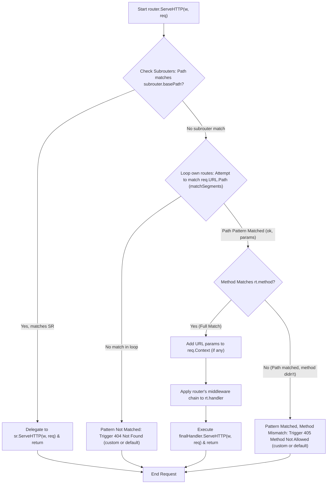
```mermaid
flowchart TD
    SH_START["Start router.ServeHTTP(w, req)"] --> SH1_SUBROUTERS{"Check Subrouters: Path matches subrouter.basePath?"}
    SH1_SUBROUTERS -- Yes, matches SR --> SH2_DELEGATE_SR["Delegate to sr.ServeHTTP(w, req) & return"]
    SH1_SUBROUTERS -- No subrouter match --> SH3_LOOP_ROUTES{"Loop own routes: Attempt to match req.URL.Path (matchSegments)"}

    SH3_LOOP_ROUTES -- No match in loop --> SH_HANDLE_404["Pattern Not Matched: Trigger 404 Not Found (custom or default)"]
    SH_HANDLE_404 --> SH_END_REQUEST["End Request"]

    SH3_LOOP_ROUTES -- Path Pattern Matched (ok, params) --> SH4_CHECK_METHOD{"Method Matches rt.method?"}
    SH4_CHECK_METHOD -- Yes (Full Match) --> SH5_ADD_PARAMS["Add URL params to req.Context (if any)"]
    SH5_ADD_PARAMS --> SH6_APPLY_CHAIN["Apply router's middleware chain to rt.handler"]
    SH6_APPLY_CHAIN --> SH7_EXEC_HANDLER["Execute finalHandler.ServeHTTP(w, req) & return"]

    SH4_CHECK_METHOD -- No (Path matched, method didn't) --> SH_HANDLE_405["Pattern Matched, Method Mismatch: Trigger 405 Method Not Allowed (custom or default)"]
    SH_HANDLE_405 --> SH_END_REQUEST

    SH2_DELEGATE_SR --> SH_END_REQUEST
    SH7_EXEC_HANDLER --> SH_END_REQUEST
```

**Internal Detail: `matchSegments(path, segments)`**
This helper compares the parts of an incoming URL path against a route's pre-compiled `segments`. It checks literal matches and, for parameter segments, validates against any compiled regex and extracts the parameter value. It returns `true` and a map of parameters if matched.

#### Flow: URL Parameter Retrieval (`Router.URLParam`)

A simple utility to retrieve a named URL parameter that was extracted during routing. It accesses the parameters map stored in the request's context using the router's unique `paramsKey`.

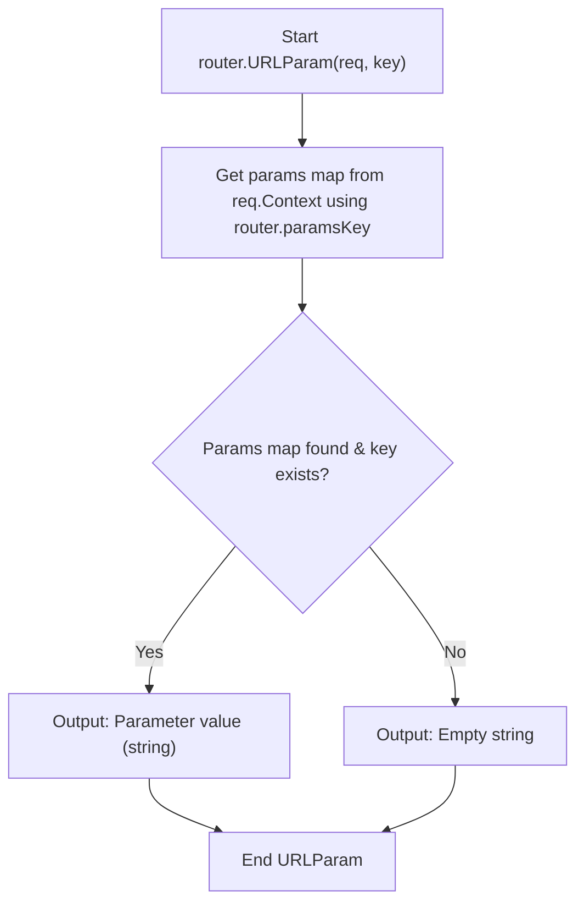
```mermaid
flowchart TD
    UP_START["Start router.URLParam(req, key)"] --> UP1["Get params map from req.Context using router.paramsKey"]
    UP1 --> UP2{"Params map found & key exists?"}
    UP2 -- Yes --> UP3_RETURN_VALUE["Output: Parameter value (string)"]
    UP2 -- No --> UP4_RETURN_EMPTY["Output: Empty string"]
    UP3_RETURN_VALUE --> UP_END["End URLParam"]
    UP4_RETURN_EMPTY --> UP_END
```

### Scaffolding

Scaffolding provides functionality to generate new Go project structures from predefined, embedded templates.
It customizes directory names, filenames, and file contents based on user input (like project name and database choice),
effectively bootstrapping a new application with a chosen layout.

The core logic resides in the createFromTemplate function, w
hich is invoked by higher-level functions like CreateMinimal, or CreateStructured.
It systematically processes template items to build the new project. If any step fails, the scaffolding process is halted, and an error is returned.

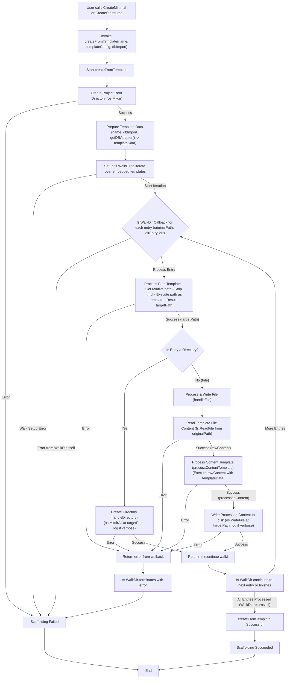
```mermaid
flowchart TD
    A_USER_CALL["User calls CreateMinimal or CreateStructured"] --> B_INVOKE_CFT["Invoke createFromTemplate(name, templateConfig, dbImport)"]

    B_INVOKE_CFT --> C_START_CFT["Start createFromTemplate"]

    C_START_CFT --> D_MKDIR_ROOT["Create Project Root Directory (os.Mkdir)"]
    D_MKDIR_ROOT -- Error --> Z_ERROR["Scaffolding Failed"]
    D_MKDIR_ROOT -- Success --> E_PREPARE_DATA["Prepare Template Data (name, dbImport, getDBAdapter() -> templateData)"]

    E_PREPARE_DATA --> F_WALK_FS_SETUP["Setup fs.WalkDir to iterate over embedded templates"]
    F_WALK_FS_SETUP -- Walk Setup Error --> Z_ERROR
    F_WALK_FS_SETUP -- Start Iteration --> G_WALK_CALLBACK{"fs.WalkDir Callback for each entry (originalPath, dirEntry, err)"}

    G_WALK_CALLBACK -- Error from WalkDir itself --> Z_ERROR
    G_WALK_CALLBACK -- Process Entry --> H_PROCESS_PATH["Process Path Template - Get relative path - Strip .tmpl - Execute path as template - Result: targetPath"]
    H_PROCESS_PATH -- Error --> Z_ERROR_CALLBACK["Return error from callback"]
    H_PROCESS_PATH -- Success (targetPath) --> I_IS_DIR{"Is Entry a Directory?"}

    I_IS_DIR -- Yes --> J_HANDLE_DIR["Create Directory (handleDirectory) (os.MkdirAll at targetPath, log if verbose)"]
    J_HANDLE_DIR -- Error --> Z_ERROR_CALLBACK
    J_HANDLE_DIR -- Success --> G_WALK_CALLBACK_NEXT["Return nil (continue walk)"]


    I_IS_DIR -- No (File) --> K_HANDLE_FILE_START["Process & Write File (handleFile)"]
    K_HANDLE_FILE_START --> L_READ_TEMPLATE["Read Template File Content (fs.ReadFile from originalPath)"]
    L_READ_TEMPLATE -- Error --> Z_ERROR_CALLBACK
    L_READ_TEMPLATE -- Success (rawContent) --> M_PROCESS_CONTENT["Process Content Template (processContentTemplate) (Execute rawContent with templateData)"]
    M_PROCESS_CONTENT -- Error --> Z_ERROR_CALLBACK
    M_PROCESS_CONTENT -- Success (processedContent) --> N_WRITE_FILE["Write Processed Content to disk (os.WriteFile at targetPath, log if verbose)"]
    N_WRITE_FILE -- Error --> Z_ERROR_CALLBACK
    N_WRITE_FILE -- Success --> G_WALK_CALLBACK_NEXT

    Z_ERROR_CALLBACK --> G_WALK_TERMINATES_ERROR["fs.WalkDir terminates with error"]
    G_WALK_CALLBACK_NEXT --> G_WALK_CALLBACK_CONTINUE["fs.WalkDir continues to next entry or finishes"]

    G_WALK_CALLBACK_CONTINUE -- More Entries --> G_WALK_CALLBACK
    G_WALK_CALLBACK_CONTINUE -- All Entries Processed (WalkDir returns nil) --> Y_SUCCESS["createFromTemplate Successful"]

    G_WALK_TERMINATES_ERROR --> Z_ERROR

    Y_SUCCESS --> Z_SUCCESS["Scaffolding Succeeded"]

    Z_SUCCESS --> Z_END["End"]
    Z_ERROR --> Z_END
```

### Migrations

Nova provides database migrations through versioned SQL files. This allows for creating new migrations, applying pending changes (migrating up), and reverting applied changes (migrating down).

#### Migration Actions

Users interact with the migration system by calling one of three main functions:
`CreateNewMigration` to scaffold a new migration file, `MigrateUp` to apply pending schema changes to the database, or `MigrateDown` to roll back previously applied changes from the database.
Each of these actions follows a distinct flow.

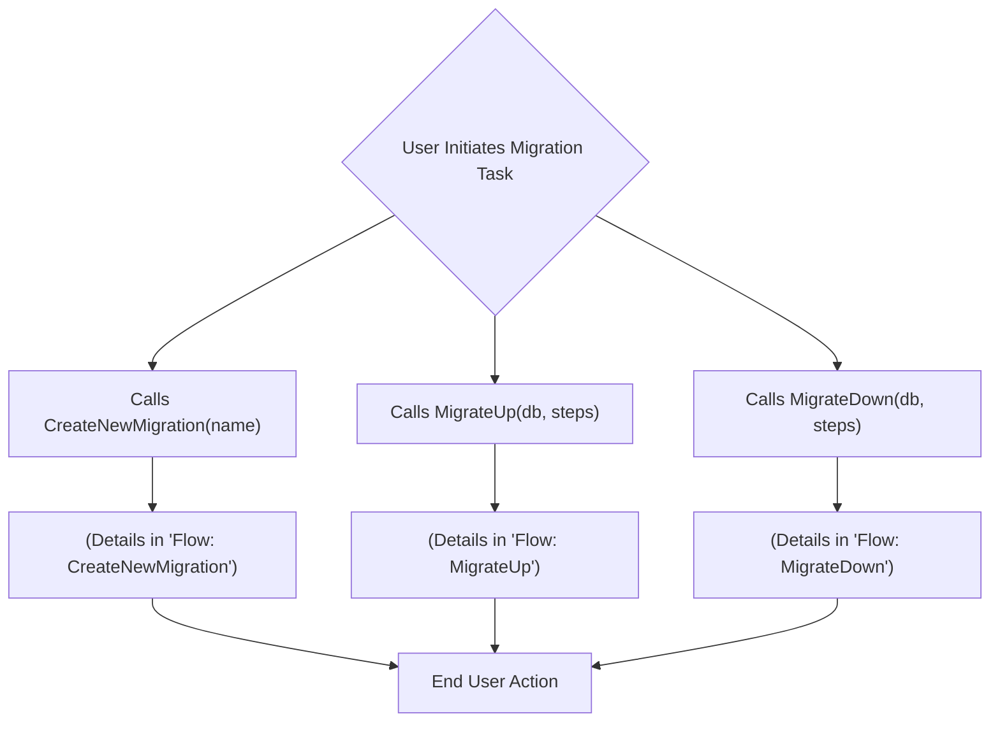
```mermaid
flowchart TD
    A_USER_ACTION{"User Initiates Migration Task"}
    A_USER_ACTION --> A1["Calls CreateNewMigration(name)"]
    A_USER_ACTION --> A2["Calls MigrateUp(db, steps)"]
    A_USER_ACTION --> A3["Calls MigrateDown(db, steps)"]

    A1 --> REF_CREATE["(Details in 'Flow: CreateNewMigration')"]
    A2 --> REF_UP["(Details in 'Flow: MigrateUp')"]
    A3 --> REF_DOWN["(Details in 'Flow: MigrateDown')"]

    REF_CREATE --> Z_END_ACTION["End User Action"]
    REF_UP --> Z_END_ACTION
    REF_DOWN --> Z_END_ACTION
```

#### Flow: `CreateNewMigration`

This function is responsible for scaffolding a new SQL migration file.
It generates a unique, timestamped filename, ensures the `migrations` directory exists (creating it if necessary),
and then writes a basic template into the new file.
This template includes the `"-- migrate:up"` and `"-- migrate:down"` delimiters to guide the user in adding their SQL statements.

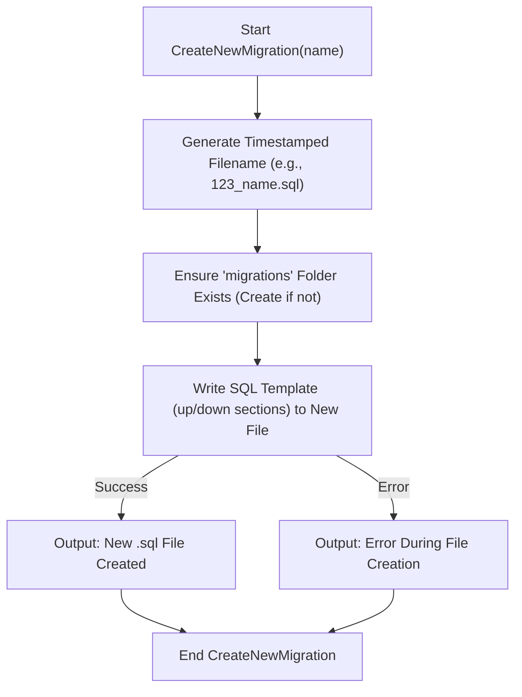
```mermaid
flowchart TD
    CNM_START["Start CreateNewMigration(name)"] --> CNM1["Generate Timestamped Filename (e.g., 123_name.sql)"]
    CNM1 --> CNM2["Ensure 'migrations' Folder Exists (Create if not)"]
    CNM2 --> CNM3["Write SQL Template (up/down sections) to New File"]
    CNM3 -- Success --> CNM_SUCCESS["Output: New .sql File Created"]
    CNM3 -- Error --> CNM_ERROR["Output: Error During File Creation"]
    CNM_SUCCESS --> CNM_END["End CreateNewMigration"]
    CNM_ERROR --> CNM_END
```

#### Flow: `MigrateUp`

The `MigrateUp` function applies pending schema changes to the database.
It first determines the current version of the database.
Then, it identifies all migration files in the `migrations` folder that have a version number greater than the current database version.
These pending migrations are sorted chronologically (oldest first) and applied sequentially, up to an optional `steps` limit.
For each migration applied, its "up" SQL statements are executed, and the database version is updated.

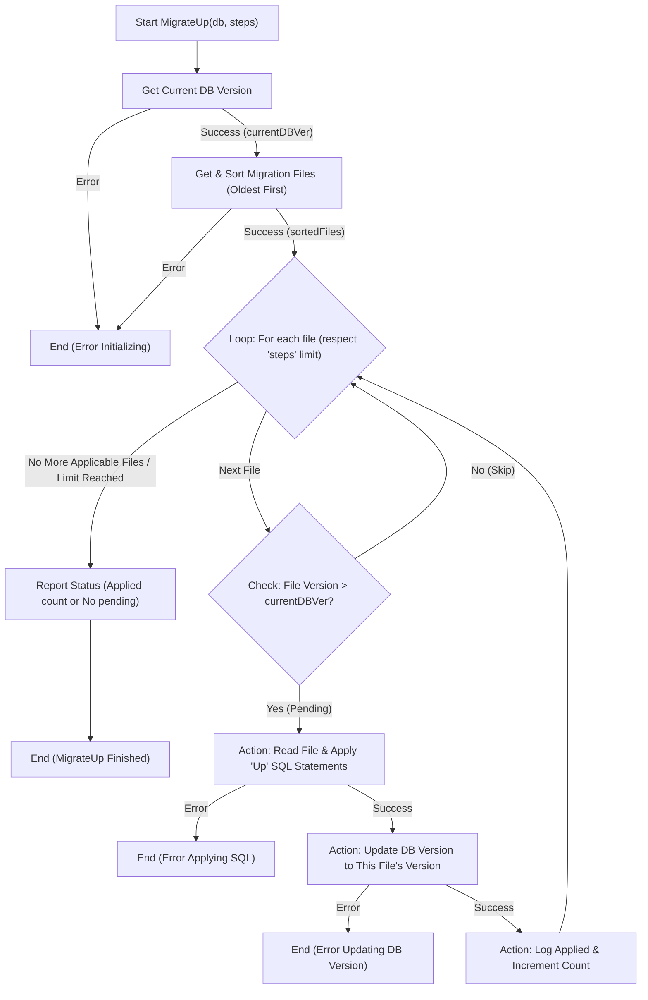
```mermaid
flowchart TD
    MU_START["Start MigrateUp(db, steps)"] --> MU1["Get Current DB Version"]
    MU1 -- Error --> MU_END_ERROR_INIT["End (Error Initializing)"]
    MU1 -- Success (currentDBVer) --> MU2["Get & Sort Migration Files (Oldest First)"]
    MU2 -- Error --> MU_END_ERROR_INIT
    MU2 -- Success (sortedFiles) --> MU3_LOOP_START{"Loop: For each file (respect 'steps' limit)"}

    MU3_LOOP_START -- No More Applicable Files / Limit Reached --> MU_REPORT["Report Status (Applied count or No pending)"]
    MU_REPORT --> MU_END_SUCCESS["End (MigrateUp Finished)"]

    MU3_LOOP_START -- Next File --> MU4_CHECK_VER{"Check: File Version > currentDBVer?"}
    MU4_CHECK_VER -- No (Skip) --> MU3_LOOP_START
    MU4_CHECK_VER -- Yes (Pending) --> MU5_APPLY["Action: Read File & Apply 'Up' SQL Statements"]
    MU5_APPLY -- Error --> MU_END_ERROR_APPLY["End (Error Applying SQL)"]
    MU5_APPLY -- Success --> MU6_UPDATE_DB["Action: Update DB Version to This File's Version"]
    MU6_UPDATE_DB -- Error --> MU_END_ERROR_DBUPDATE["End (Error Updating DB Version)"]
    MU6_UPDATE_DB -- Success --> MU7_LOG["Action: Log Applied & Increment Count"]
    MU7_LOG --> MU3_LOOP_START
```

#### Flow: `MigrateDown`

The `MigrateDown` function reverts previously applied migrations.
It starts by getting the current database version.
It then considers migration files sorted in reverse chronological order (newest first).
For each migration whose version is less than or equal to the current database version (and within the `steps` limit, which defaults to 1),
its "down" SQL statements are executed. After a successful rollback, the database version is updated to reflect the state before that migration was applied.

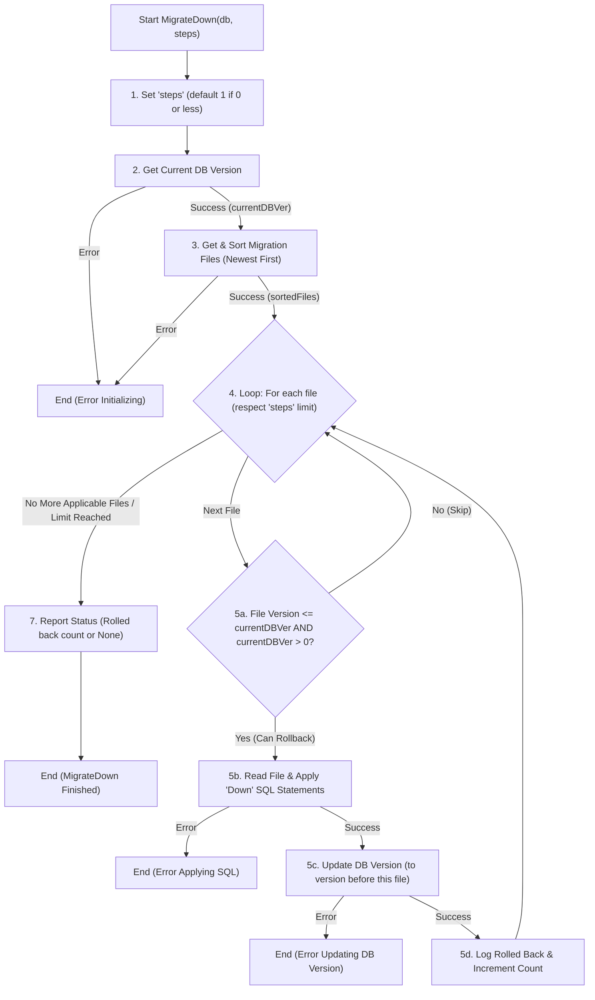
```mermaid
flowchart TD
    MD_START["Start MigrateDown(db, steps)"] --> MD0["1. Set 'steps' (default 1 if 0 or less)"]
    MD0 --> MD1["2. Get Current DB Version"]
    MD1 -- Error --> MD_END_ERROR_INIT["End (Error Initializing)"]
    MD1 -- Success (currentDBVer) --> MD2["3. Get & Sort Migration Files (Newest First)"]
    MD2 -- Error --> MD_END_ERROR_INIT
    MD2 -- Success (sortedFiles) --> MD3_LOOP_START{"4. Loop: For each file (respect 'steps' limit)"}

    MD3_LOOP_START -- No More Applicable Files / Limit Reached --> MD_REPORT["7. Report Status (Rolled back count or None)"]
    MD_REPORT --> MD_END_SUCCESS["End (MigrateDown Finished)"]

    MD3_LOOP_START -- Next File --> MD4_CHECK_VER{"5a. File Version <= currentDBVer AND currentDBVer > 0?"}
    MD4_CHECK_VER -- No (Skip) --> MD3_LOOP_START
    MD4_CHECK_VER -- Yes (Can Rollback) --> MD5_APPLY["5b. Read File & Apply 'Down' SQL Statements"]
    MD5_APPLY -- Error --> MD_END_ERROR_APPLY["End (Error Applying SQL)"]
    MD5_APPLY -- Success --> MD6_UPDATE_DB["5c. Update DB Version (to version before this file)"]
    MD6_UPDATE_DB -- Error --> MD_END_ERROR_DBUPDATE["End (Error Updating DB Version)"]
    MD6_UPDATE_DB -- Success --> MD7_LOG["5d. Log Rolled Back & Increment Count"]
    MD7_LOG --> MD3_LOOP_START
```

### OpenAPI

The `nova` framework can automatically generate an OpenAPI 3.0 specification from your router definitions and associated Go types.
This allows for easy documentation and client generation. The process involves collecting route information, building operation details,
and generating JSON schemas for request/response bodies and parameters.
The generated specification can then be served as a JSON file, and an embedded Swagger UI can be hosted to visualize and interact with the API.

#### Overall OpenAPI Process

The generation of the OpenAPI specification is primarily orchestrated by `GenerateOpenAPISpec`.
This function initializes the spec and then recursively traverses the router structure using `collectRoutes` to populate path and operation details.
Once generated, `ServeOpenAPISpec` can expose it via an HTTP endpoint, and `ServeSwaggerUI` can provide an interactive API console.

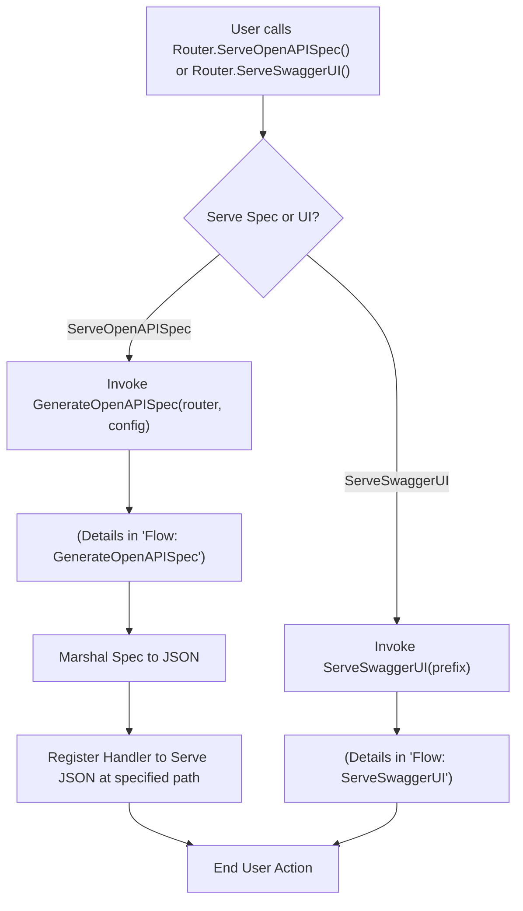
```mermaid
flowchart TD
    A_USER_CALLS["User calls Router.ServeOpenAPISpec() or Router.ServeSwaggerUI()"]

    A_USER_CALLS --> B_SERVE_SPEC_OR_UI{"Serve Spec or UI?"}

    B_SERVE_SPEC_OR_UI -- ServeOpenAPISpec --> C1_GEN_SPEC["Invoke GenerateOpenAPISpec(router, config)"]
    C1_GEN_SPEC --> REF_GEN_SPEC["(Details in 'Flow: GenerateOpenAPISpec')"]
    REF_GEN_SPEC --> C2_MARSHAL["Marshal Spec to JSON"]
    C2_MARSHAL --> C3_SERVE_JSON["Register Handler to Serve JSON at specified path"]
    C3_SERVE_JSON --> Z_END_ACTION["End User Action"]

    B_SERVE_SPEC_OR_UI -- ServeSwaggerUI --> D1_SERVE_UI["Invoke ServeSwaggerUI(prefix)"]
    D1_SERVE_UI --> REF_SERVE_UI["(Details in 'Flow: ServeSwaggerUI')"]
    REF_SERVE_UI --> Z_END_ACTION
```

#### Flow: `GenerateOpenAPISpec`

This is the main function responsible for constructing the complete OpenAPI specification object.
It initializes the basic structure of the spec (like OpenAPI version, info)
and then kicks off the route collection process.
It uses a `schemaGenCtx` to manage and reuse generated schemas in the `components` section.

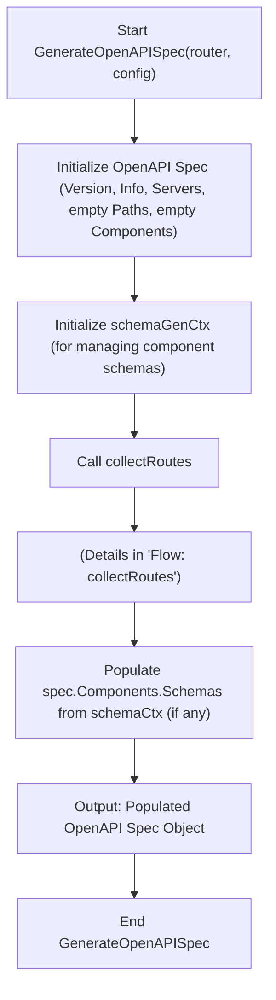
```mermaid
flowchart TD
    GEN_START["Start GenerateOpenAPISpec(router, config)"] --> GEN1["Initialize OpenAPI Spec (Version, Info, Servers, empty Paths, empty Components)"]
    GEN1 --> GEN2["Initialize schemaGenCtx (for managing component schemas)"]
    GEN2 --> GEN3_COLLECT["Call collectRoutes"]
    GEN3_COLLECT --> REF_COLLECT_ROUTES["(Details in 'Flow: collectRoutes')"]
    REF_COLLECT_ROUTES --> GEN4["Populate spec.Components.Schemas from schemaCtx (if any)"]
    GEN4 --> GEN_OUTPUT["Output: Populated OpenAPI Spec Object"]
    GEN_OUTPUT --> GEN_END["End GenerateOpenAPISpec"]
```

#### Flow: `collectRoutes` (Recursive)

This function recursively traverses the router and its sub-routers.
For each route it encounters, it constructs the full path string,
creates or retrieves the corresponding `PathItem` in the OpenAPI spec,
and then builds the `Operation` object for that specific HTTP method and path.

```mermaid
flowchart TD
    CR_START["Start collectRoutes(router, spec, schemaCtx, parentPath)"]
    CR_START --> CR1_LOOP_ROUTES{"For each route in router.routes"}
    CR1_LOOP_ROUTES -- Next Route --> CR2_BUILD_PATH["Build Full Path String (uses buildPathString)"]
    CR2_BUILD_PATH --> CR3_GET_PATHITEM["Get/Create PathItem in spec.Paths"]
    CR3_GET_PATHITEM --> CR4_BUILD_OP["Build Operation (uses buildOperation)"]
    CR4_BUILD_OP --> REF_BUILD_OP["(Details in 'Flow: buildOperation')"]
    REF_BUILD_OP --> CR5_ASSIGN_OP["Assign Operation to PathItem (e.g., pathItem.Get = op)"]
    CR5_ASSIGN_OP --> CR1_LOOP_ROUTES
    CR1_LOOP_ROUTES -- All Routes Processed --> CR6_LOOP_SUBROUTERS{"For each subrouter in router.subrouters"}

    CR6_LOOP_SUBROUTERS -- Next Subrouter --> CR7_RECURSE["Recursive Call: collectRoutes(subrouter, spec, schemaCtx, subrouter.basePath)"]
    CR7_RECURSE --> CR6_LOOP_SUBROUTERS
    CR6_LOOP_SUBROUTERS -- All Subrouters Processed --> CR_END["End collectRoutes"]
```

#### Flow: `buildOperation`

For a given route, this function constructs an OpenAPI `Operation` object.
It populates details like tags, summary, description, and parameters based on `route.options`.
It also handles the generation of schemas for request bodies and responses by calling `generateSchema`.
Path parameters defined in the route segments are also ensured to be part of the operation's parameters.

```mermaid
flowchart TD
    BO_START["Start buildOperation(route, schemaCtx)"] --> BO1["Initialize Operation Object (empty Responses, Parameters)"]
    BO1 --> BO2_CHECK_OPTS{"Route Options Defined?"}
    BO2_CHECK_OPTS -- No --> BO_PROCESS_PATH_PARAMS
    BO2_CHECK_OPTS -- Yes (opts exist) --> BO3_POPULATE_META["Populate Meta (Tags, Summary, Desc, OpID, Deprecated)"]
    BO3_POPULATE_META --> BO4_REQ_BODY{"RequestBody Option?"}
    BO4_REQ_BODY -- Yes --> BO5_BUILD_REQ_BODY["Create RequestBodyObject, call generateSchema for its content"]
    BO5_BUILD_REQ_BODY --> REF_GEN_SCHEMA_REQ["(Uses 'Flow: generateSchema')"]
    REF_GEN_SCHEMA_REQ --> BO6_RESPONSES
    BO4_REQ_BODY -- No --> BO6_RESPONSES

    BO6_RESPONSES{"Loop Response Options"}
    BO6_RESPONSES -- Next ResponseOpt --> BO7_BUILD_RESP["Create ResponseObject, call generateSchema for body"]
    BO7_BUILD_RESP --> REF_GEN_SCHEMA_RESP["(Uses 'Flow: generateSchema')"]
    REF_GEN_SCHEMA_RESP --> BO6_RESPONSES
    BO6_RESPONSES -- Done --> BO8_PARAMS{"Loop Parameter Options"}

    BO8_PARAMS -- Next ParamOpt --> BO9_BUILD_PARAM["Create ParameterObject, call generateSchema for schema"]
    BO9_BUILD_PARAM --> REF_GEN_SCHEMA_PARAM["(Uses 'Flow: generateSchema')"]
    REF_GEN_SCHEMA_PARAM --> BO8_PARAMS
    BO8_PARAMS -- Done --> BO_PROCESS_PATH_PARAMS

    BO_PROCESS_PATH_PARAMS["Ensure Path Parameters from route.segments are added (if not already from options)"]
    BO_PROCESS_PATH_PARAMS --> BO10_DEFAULT_RESP{"Add Default '200 OK' Response if none specified"}
    BO10_DEFAULT_RESP --> BO_OUTPUT["Output: Populated Operation Object"]
    BO_OUTPUT --> BO_END["End buildOperation"]
```

#### Flow: `generateSchema` (Recursive & Type Handling)

This is the core schema generation logic.
Given a Go interface{} instance,
it uses reflection to determine its type and generate a corresponding OpenAPI `SchemaObject`.
It handles basic Go types (string, int, bool, etc.), structs, slices/arrays, and maps.
For structs, it generates named schemas and stores them in `schemaCtx.componentsSchemas` to allow for reuse via `$ref` pointers, preventing duplication and handling circular dependencies.

```mermaid
flowchart TD
    GS_START["Start generateSchema(instance, schemaCtx)"] --> GS1{"Handle nil/ptr, Get reflect.Type & Value"}
    GS1 --> GS2_CHECK_CACHE{"Struct & Already Generated (in schemaCtx)?"}
    GS2_CHECK_CACHE -- Yes --> GS_RETURN_REF["Output: SchemaObject with $ref"]

    GS2_CHECK_CACHE -- No --> GS3_SWITCH_KIND{"Switch on Type Kind"}
    GS3_SWITCH_KIND -- Struct --> GS_STRUCT["Handle Struct"]
    GS_STRUCT --> GS_STRUCT_TIME{"time.Time?"}
    GS_STRUCT_TIME -- Yes --> GS_TIME_SCHEMA["Set type:string, format:date-time"]
    GS_STRUCT_TIME -- No --> GS_STRUCT_NAME["Generate/Get Unique Schema Name"]
    GS_STRUCT_NAME --> GS_STRUCT_RESERVE["Add to schemaCtx (initially nil for cycle breaking)"]
    GS_STRUCT_RESERVE --> GS_STRUCT_PROPS["Iterate Fields: Get JSON name, recursively call generateSchema for field type, add to Properties"]
    GS_STRUCT_PROPS --> REF_GS_FIELD["(Recursive calls use 'Flow: generateSchema')"]
    REF_GS_FIELD --> GS_STRUCT_REQ["Determine Required Fields"]
    GS_STRUCT_REQ --> GS_STRUCT_STORE["Store final schema in schemaCtx"]
    GS_STRUCT_STORE --> GS_RETURN_REF

    GS3_SWITCH_KIND -- Slice/Array --> GS_ARRAY["Handle Slice/Array: Set type:array, recursively call generateSchema for Items"]
    GS_ARRAY --> REF_GS_ITEMS["(Recursive call uses 'Flow: generateSchema')"]
    REF_GS_ITEMS --> GS_SCHEMA_BUILT

    GS3_SWITCH_KIND -- Map --> GS_MAP["Handle Map: Set type:object, recursively call generateSchema for AdditionalProperties"]
    GS_MAP --> REF_GS_ADD_PROPS["(Recursive call uses 'Flow: generateSchema')"]
    REF_GS_ADD_PROPS --> GS_SCHEMA_BUILT

    GS3_SWITCH_KIND -- Primitives (string, int, bool, etc.) --> GS_PRIMITIVE["Handle Primitives: Set type & format"]
    GS_PRIMITIVE --> GS_SCHEMA_BUILT

    GS3_SWITCH_KIND -- Other/Unsupported --> GS_UNSUPPORTED["Handle Unsupported: Log warning, set basic object type"]
    GS_UNSUPPORTED --> GS_SCHEMA_BUILT

    GS_TIME_SCHEMA --> GS_SCHEMA_BUILT
    GS_SCHEMA_BUILT["Schema Object Constructed (without $ref)"] --> GS_OUTPUT_DIRECT["Output: SchemaObject"]

    GS_OUTPUT_DIRECT --> GS_END["End generateSchema"]
    GS_RETURN_REF --> GS_END
```

#### Flow: `ServeSwaggerUI`

This function sets up HTTP handlers to serve the embedded Swagger UI static assets. It handles requests for the UI's root path (redirecting if necessary), the `index.html` file, and other assets like CSS and JavaScript files, serving them from the embedded filesystem.

```mermaid
flowchart TD
    SSUI_START["Start ServeSwaggerUI(prefix)"] --> SSUI1["Get Sub-Filesystem for embedded 'swagger-ui' assets"]
    SSUI1 -- Error --> SSUI_PANIC["Panic: Failed to locate assets"]
    SSUI1 -- Success --> SSUI2_HANDLE_ROOT["Register Handler for 'prefix': Redirects to 'prefix/'"]
    SSUI2_HANDLE_ROOT --> SSUI3_HANDLE_INDEX["Register Handler for 'prefix/': Serves 'index.html' from embedded FS"]
    SSUI3_HANDLE_INDEX --> SSUI4_HANDLE_ASSETS["Register Handler for 'prefix/{file}': Serves other static assets (CSS, JS, etc.) from embedded FS with correct Content-Type"]
    SSUI4_HANDLE_ASSETS --> SSUI5_LOG["Log Swagger UI served"]
    SSUI5_LOG --> SSUI_END["End ServeSwaggerUI"]
```
